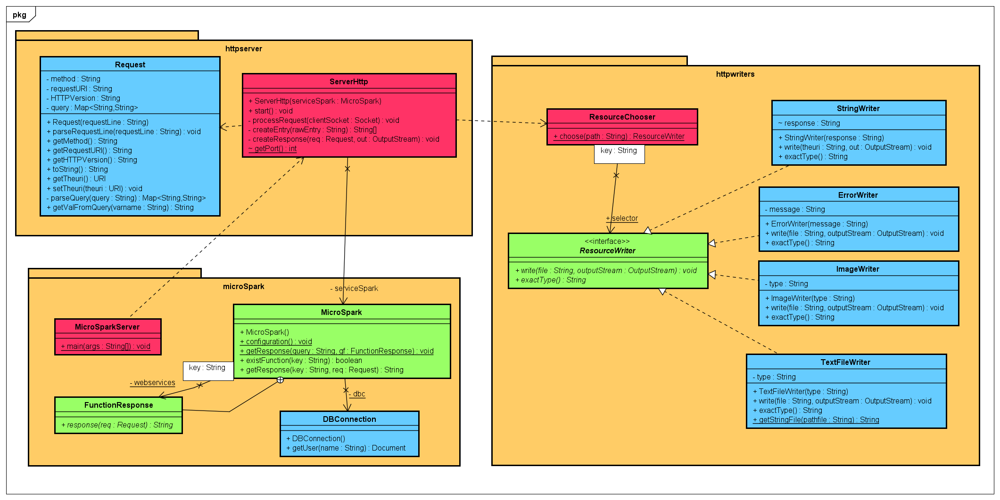

# Taller Clientes y Servicios (MicroSpark)

Esta aplicación web permite colocar servicios/funciones por path (o paths y query) y tambien retornar recursos estaticos


## Autor

* **J. Eduardo Arias Barrera** - [AriasAEnima](https://github.com/AriasAEnima)

# Documento:
## [(Click Aqui)](https://github.com/AriasAEnima/Taller-Clientes-Servicios/blob/master/informe.pdf)

# CircleCI
[](https://circleci.com/gh/AriasAEnima/Taller-Clientes-Servicios)

# Heroku

## https://taller-clientes-servicios.herokuapp.com/

## Documentación:

Se encuentra en la carpeta y se puede generar
```
> cd src/main/resources/javadoc
```

### Prerrequisitos

Java JDK 1.8, Maven , Git, Spark (Dependencia)

* [JAVA JDK 8](http://www.oracle.com/technetwork/java/javase/overview/index.html) - Version de Java
* [Maven](https://maven.apache.org/) - Maven


## Para empezar

Se debe ejecutar en la carpeta que queremos que esté
```
> git clone https://github.com/AriasAEnima/Taller-Clientes-Servicios.git
```
### Instalación

Primero ejecutamos maven en la carpeta raíz, esto compilara el aplicativo

```
> mvn package
```


## Ejecución:
Podremos usarlo en local directamente con el siguiente comando
En linux:

```
> java $JAVA_OPTS -cp target/classes:target/dependency/* edu.escuelaing.arep.introSpark.CalculatorApp

```
En windows:
```
> java -cp target/classes:target/dependency/* edu.escuelaing.arep.tallerClientesServicios.microSpark.MicroSparkServer

```
O con heroku CLI si se tiene instalado con
```
> heroku local web
```

En el caso de usar java por terminal estará en el puerto :

```
localhost:35000
```

En el caso de usar heroku estará en el puerto:

```
localhost:5000
```

Y solo tendremos que colocar los números separados por espacios y . para el decimal y presionar en "Calcular"


## Diseño Utilizado



## Pruebas:

Se realizo pruebas sobre la misma interfaz :
Recurso estáticos:

* Imagenes
https://taller-clientes-servicios.herokuapp.com/img/01-screenshot.jpg


* Html css y js :
https://taller-clientes-servicios.herokuapp.com/index.html


## Funciones

* hello (parametro name)
https://taller-clientes-servicios.herokuapp.com/hello?name=Daniel


* / ruta raiz
https://taller-clientes-servicios.herokuapp.com

* potencia (parametros x y)
https://taller-clientes-servicios.herokuapp.com/potencia?x=2&y=4


* database (parametro name)
https://taller-clientes-servicios.herokuapp.com/users?name=maria


## Licencia

This project is licensed under the MIT License  - see the [LICENSE](LICENSE) file for details
